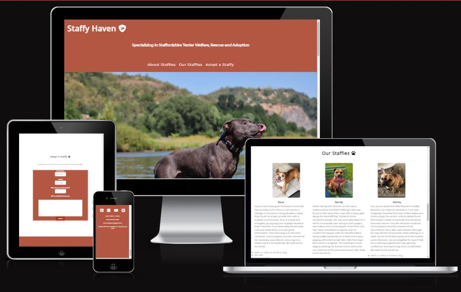
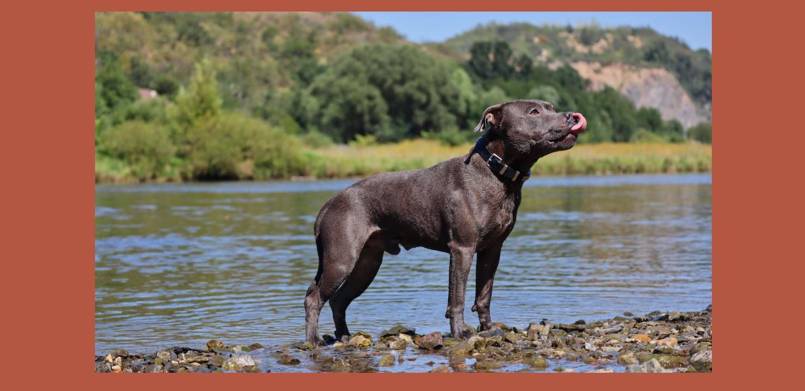
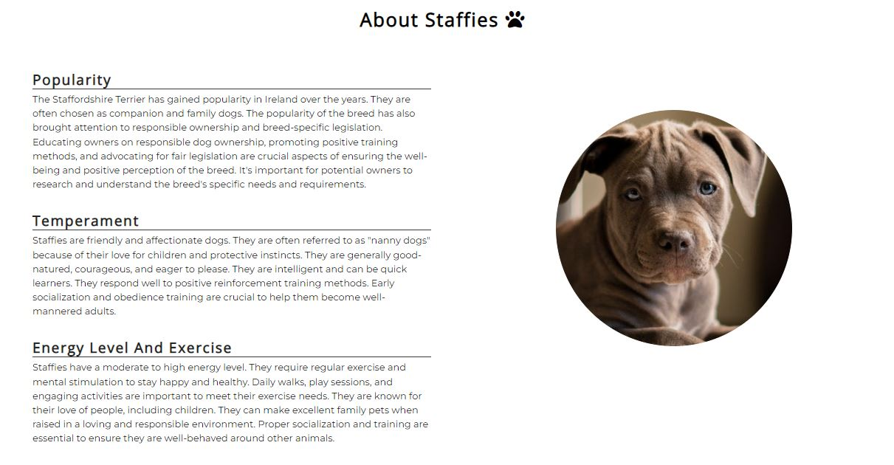
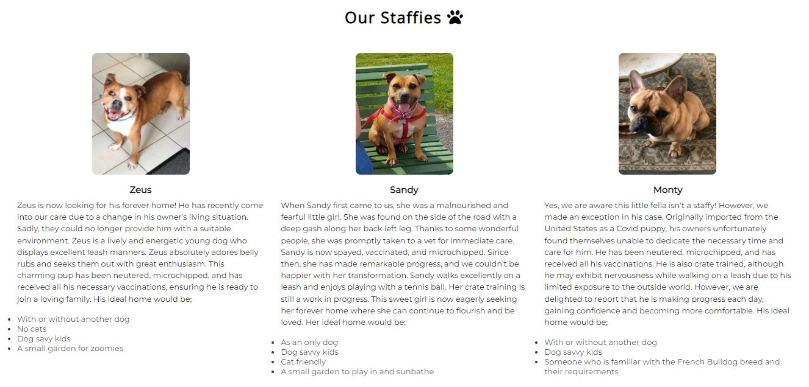
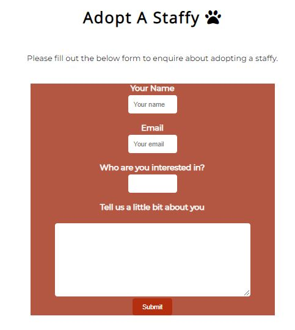
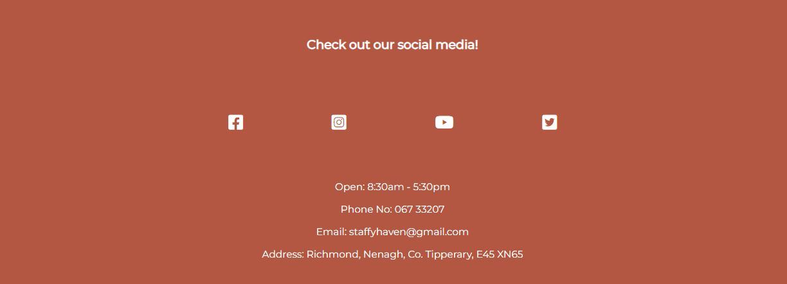
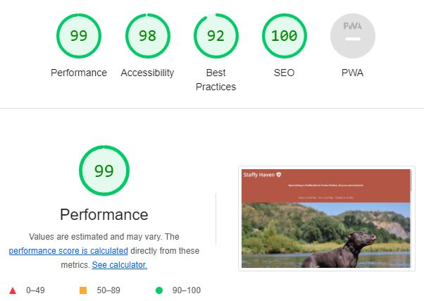

# Staffy Haven

Staffy Havens aim is to educate the public about the Staffordshire Terrier breed, rescue and rehabilitate staffies and facilitate adoptions.

Users of this website will have to opprrtunity to learn about the breeds popularity, temperament and their specific needs. Users will also be able to view the profiles of staffies available for adoption. If a user is interested in rescuing a staffy, they can inquire using the provided contact details or by filling out the form.

# User Experience (UX)

## User Stories

- First Time Visitor Goals

  - As a first time visitor, I want to be able to easily understand the main purpose of the website.

  - As a first time visitor, I want to be able to easily navigate through the site.

  - As a first time visitor, I want to know what the site offers.

  - As a first time visitor, I want to be able to locate their social media links to determine how trustworthy as an organisation they are.

- Returning Visitor Goals

  - As a returning visitor, I want to see if there are any other staffies available for adoption.

  - As a returing visitor, I want the option to enquire about adoption should I be interested.

- Frequent User Goals

  - As a frequent user, I want to see if there are any updates to the website such as more staffies available for adoption.

  - As a frequent user, I want the option to easily contact the organisation.

## Design

- ### Color Scheme

  - The main colors used are terracota and white. They work well together as a visually appealling aesthetic.

  - Terrecotta is used as the background color for the header, navigation bar and background for the main image. This provides a consistent color scheme that the user is first introduced to. The main image contrasts well with the background.

  - Terrecotta is used as the background color for the form elements. White is used for the input fields and works well with the white section background.to maintain readability.

  - Terracotta is used on the footer with white text once again to provide consistency throughout the design.

- ### Typography

  - The Montserratt font is the main font used throughout the website and has a fallback of Sans Serif, should the font not be imported correctly.

## Features

- ### Navigation

  - The navigation features the website title on the top left corner.

  - There is a short line in the centre between the title and navigation links that explains the purpose of the page to a first time user or repeat user of the website.

  - The navigation links are aligned centrally just above the main image and include: About Staffies, Our Staffies and Adopt a Staffy which link to different sections on the same page.

  - The navigation font color is white to contrast with the background.

  - The navigation tells the user the name of the website and organisation, the organisations purpose and makes different sections of information easy to find.

- ### Main Image

  - The main image is the first thing a user sees and is situated below the navigation. It depicts a Staffordshire Terrier to let to reinforce that the page is for this breed.

  - The contrast of the outdoor image on the terracotta background immediately catches the users attention.

- ### About Staffies Section

  - The "About Staffies" section provides valuable information to users regarding the popularity, temperament and energy levels and exercise of the breed.

  - This section aims to inform and educate the user about the breed, their benefits and their needs. This motentially helps the user to consider adopting a staffy.

- ### Our Staffies Section

  - The "Our Staffies" section serves as a platoorm to show the user which dogs are available for adoption.

  - Each dog is accompanied by a photograph along with a short summary. This summary includes information on the dogs background, personality and individual requirements.

  - This section assists the user in making an informed decision and potentially take the next step in adopting a staffy.

- ### Adopt a Staffy

  - The "Adopt a Staffy" section provides the user with a means to inquire about a specific staffy available for adoption.

  - The user must provide their name. This helps the organisation personalize their communication.

  - The user must provide their email address. This helps the organisation to communicate with their user regarding their adoption query.

  - The user must select which available staffy they are interested in. This helps the organisation understand the users preferences and focus on the specific staffy they desire.

  - The user is provided with an optional field where they can provide additional information about themselves. This helps the organisation assess potential adopters and ensure the dog and potential adopter are compatible.

- ### Footer

  - The footer provides the user links to access the organisations social media on Facebook, Youtube, Instagram and Twitter.

  - It also provides the user with contact details for the organisation should they wish to inquire directly.

- ### Features left to implement

  - The addition of a second page to show the user previously successful adoption stories, consisting of a photo gallery and brief summary which the user can browse through.

  - The addition of checkbox on the bottom of the form for the user to select "Yes" or "No" to determine if the user would like to recieve additional content in relation to the Staffy breed.

## Testing

The W3C Markup Validator and W3C CSS Validator Services were used to validate every page to ensure no errors occurred.

- [W3C CSS Validator Result](https://jigsaw.w3.org/css-validator/validator?uri=https%3A%2F%2Fhugh1996.github.io%2FStaffies4U-PP1%2F&profile=css3svg&usermedium=all&warning=1&vextwarning=&lang=en)

- [W3C Markup Validator Result](https://validator.w3.org/nu/?doc=https%3A%2F%2Fhugh1996.github.io%2FStaffies4U-PP1%2F)

I also confirmed the colors and font are easy to raad and accessible using lighthouse in devtools.

### Testing User Stories from User Experience (UX)

- ## User Stories

- #### First Time Visitor Goals

- As a first time visitor, I want to be able to easily understand the main purpose of the website.

  - When first entering the site, the user is met with the page title, the organisations aim and a readable navigation bar.
  - The organisations purpose is emphasised by the main image.

- As a first time visitor, I want to be able to easily navigate through the site.

  - The user may either use the navigation links or the scroll bar to move throughout the site.
  - The easily readable navigation links show the user what section of the site it will direct them to upon clicking.

- As a first time visitor, I want to know what the site offers.

  - As the user navigates thoough the site, they will discover information about the breed, who is available for adoption and how to apply for adoption.

  - As a first time visitor, I want to be able to locate their social media links to determine how trustworthy as an organisation they are.

  - The user can access the social media links in the footer, to view the organisations various social media accounts and find out further information.

- #### Returning Visitor Goals

a. As a returning visitor, I want to see if there are any other staffies available for adoption.

- The user can review the "Our Staffies" section which is updated regularly once new dogs have been resuced and rehabilitated.

b. As a returing visitor, I want the option to enquire about adoption should I be interested.

- The user has the option to enquire about a particular staffy by filling out the form or alternatively contact the organisation directly using the contact details in the footer.

- Frequent User Goals

  a. As a frequent user, I want to see if there are any updates to the website such as more staffies available for adoption.

  b. As a frequent user, I want the option to easily contact the organisation.

- ### Further Testing

  - I tested this page works in different browsers: Google Chrome, Microsoft Edge.

  - To confirm responsiveness.

  - I confirmed the navigation links work and are easily readable.

  - I confirmed the form and its submit button works.

  - I confirmed the social media links work.

  - Friends and family confirmed the site color scheme and font style works well together.

## Bugs

- When reviewing my README on github page, the images did not appear. I discovered this was due to using an absolute file path as opposed to a relative file path.

## Deployment

- The site was deployed using GitHub Pages. To deploy, follow the below steps;

- In the repository, click on 'Settings'.
- Scroll down on the left hand side and select 'Pages'.
- Here will you will find a link to the live webpage.
- View the live website here - [Staffy Haven](https://hugh1996.github.io/Staffies4U-PP1/).

## Technologies Used

- ### Languages

  - HTML5
  - CSS3

- ### Libraries & Programs

  - Font Awesome
  - Google Fonts
  - Git
  - Codeanywhere
  - Github

## Credits

- ### Content

  - The code used for social media links was taken from the Code Institute Love Running walkthrough project.

  - Text content for "About Staffies" section taken from sources [Wikipedia](https://www.wikipedia.org/) and [Staffie Rescue UK](https://www.staffierescue.co.uk/).

- ### Media

  - The main image and the image for the "About Staffies" section were both taken from [Pexels](https://www.pexels.com/).

  - Credit to my three family dogs and their backgrounds for the images and text content in the "Our Staffies" section.

  - Icons for social media links taken from [Font Awesome](https://fontawesome.com/).
